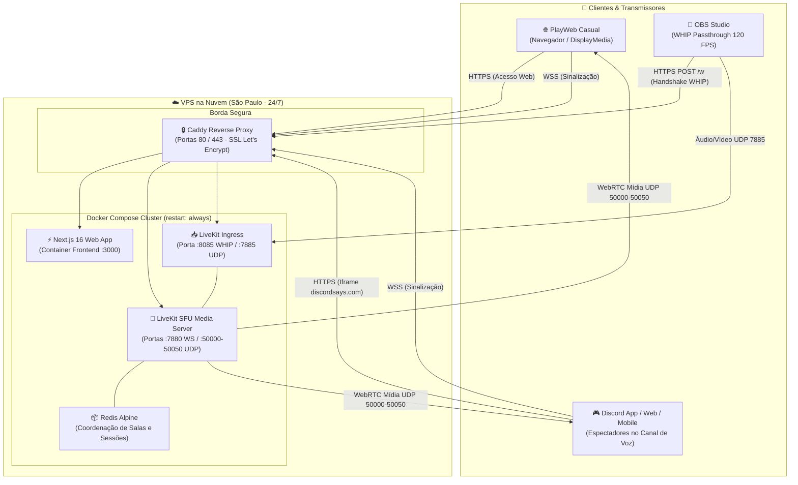

# 🍃 EcoLive v1.2.0 - Discord Streaming Platform

<p align="center">
  
  
  
  
  
</p>

> **Plataforma de transmissão WebRTC de ultra-baixa latência integrada nativamente aos canais de voz do Discord (*Discord Embedded App / Activity*). Suporta streaming direto pelo navegador e ingestão profissional via OBS Studio (WHIP) com até 120 FPS.**  
> *Autor: Kayque Reis ([@kr3mega](https://github.com/kr3mega))*

---

## 🎯 1. Visão Geral do Projeto

O **EcoLive** é uma Atividade oficial (*Embedded App*) para o Discord desenvolvida para resolver as limitações de qualidade, estabilidade e latência de transmissões convencionais. 

Operando sobre um cluster WebRTC SFU (*Selective Forwarding Unit*) hospedado em São Paulo (Brasil), o sistema entrega vídeo de alta fidelidade (**1080p a 60 / 120 FPS**) com latência inferior a **200ms**, permitindo que amigos assistam a gameplays e interajam em tempo real como se estivessem no mesmo cômodo.

---

## ⚡ 2. Principais Funcionalidades & Diferenciais

* **🚀 Latência Ultra-Baixa Real (< 200ms):** Conexão direta WebRTC via UDP sobre SFU, sendo de **10 a 20 vezes mais rápida** que plataformas tradicionais como Twitch e YouTube.
* **🎭 Avatares e Identidade Oficial do Discord (OAuth2):** Autenticação transparente integrada ao *Discord Embedded App SDK*. O aplicativo carrega a foto de perfil original do Discord de quem entra e lista todos os amigos conectados no canal com seleção em 1 clique.
* **⚡ Transmissão Sob Demanda (Estilo Discord):** Cada espectador escolhe individualmente quais transmissões abrir através de um botão central *"Assistir Transmissão"*. Streams fechadas operam em **0 kbps** no SFU, poupando totalmente o processador, a placa de vídeo e a largura de banda do espectador.
* **🎥 Dupla Modalidade de Transmissão:**
  * **PlayWeb Casual (Nativo no Iframe):** Captura de tela com 1 clique diretamente pelo navegador (`getDisplayMedia`). Zero downloads, zero scripts, rodando isolado na sandbox do Discord com Simulcast por hardware em 3 camadas.
  * **OBS Studio Profissional (WHIP):** Ingestão em tempo real via protocolo WHIP (*WebRTC HTTP Ingestion*) com **Passthrough puro**: o stream sai direto da GPU (NVENC/AMF/AV1) para o servidor sem consumir processamento de CPU e blindado contra travamentos de Anti-Cheat de nível de Kernel (Riot Vanguard, Easy Anti-Cheat).
* **🖥️ Grid Dinâmico Multistream & Controles em Lote:** Vários usuários podem transmitir simultaneamente na mesma sala com suporte a botões rápidos de *"Assistir Todas"* e *"Fechar Todas"*.
* **📊 HUD de Telemetria & Painel de Diagnóstico:** Painel de diagnóstico integrado ao player mostrando Resolução, FPS decodificado, Bitrate em Mbps, Latência (Ping), Perda de Pacotes (*Packet Loss*) e janela retrátil de logs com cópia em 1 clique.
* **☁️ Infraestrutura Autônoma 24/7:** Hospedado em VPS com link de 1 Gbit/s em São Paulo, Proxy Reverso Caddy com certificados SSL automáticos da Let's Encrypt (`*.sslip.io`) e reinicialização automática em containers Docker.

---

## 🏗️ 3. Arquitetura do Sistema



---

## 🛠️ 4. Stack Tecnológica

| Camada | Tecnologias Utilizadas |
| :--- | :--- |
| **Frontend** | [Next.js 16](https://nextjs.org/) (App Router, Turbopack), [React 19](https://react.dev/), [TypeScript](https://www.typescriptlang.org/), [Tailwind CSS v4](https://tailwindcss.com/) |
| **Streaming & WebRTC** | [LiveKit Client SDK](https://github.com/livekit/client-sdk-js), [LiveKit React Components](https://github.com/livekit/components-js), LiveKit Server SDK |
| **Integração Discord** | [@discord/embedded-app-sdk](https://github.com/discord/embedded-app-sdk), OAuth2 Flow Nativo |
| **Servidores de Mídia** | [LiveKit Server](https://github.com/livekit/livekit) (Go SFU), [LiveKit Ingress](https://github.com/livekit/ingress) (WHIP Server), [Redis](https://redis.io/) (Alpine) |
| **Borda e Segurança** | [Caddy Server](https://caddyserver.com/) (HTTP/3, TLS automático Let's Encrypt), UFW Firewall |
| **Infraestrutura** | [Docker](https://www.docker.com/) & Docker Compose, Ubuntu 24.04 LTS (Datacenter em São Paulo) |

---

## 🔒 5. Segurança & Isolamento de Credenciais (Zero-Leakage)

* **Zero-Leakage no Frontend:** Nenhuma chave secreta ou token sensível reside no código do cliente ou usa o prefixo `NEXT_PUBLIC_`. O `DISCORD_CLIENT_SECRET` é mantido exclusivamente no backend para a troca de código OAuth2.
* **Tokens JWT de Curta Duração:** Os tokens de acesso à sala WebRTC são gerados dinamicamente via `/api/token` com TTL de 4 horas e assinados no backend.
* **Isolamento de Salas:** As salas são vinculadas rigidamente ao `channel_id` do canal de voz do Discord. Usuários em canais de voz diferentes operam em universos WebRTC 100% isolados.
* **Anti-Cache:** Todas as respostas da API de credenciais contam com cabeçalhos `Cache-Control: no-store, no-cache, must-revalidate` para mitigar armazenamento em proxies intermediários.

---

## 🚀 6. Como Executar Localmente (Ambiente de Desenvolvimento)

### Pré-requisitos
* [Node.js](https://nodejs.org/) v20+ e `npm`
* [Docker](https://www.docker.com/) e Docker Compose (opcional caso queira rodar o SFU localmente)

### 1. Clonar o Repositório
```bash
git clone https://github.com/kr3mega/ecolive-discord-streaming.git
cd ecolive-discord-streaming
```

### 2. Configurar o Frontend
```bash
cd frontend
cp .env.example .env.local
npm install
npm run dev
```
Acesse `http://localhost:3000` no seu navegador.

### 3. (Opcional) Subir o Cluster Local via Docker
Caso queira rodar o SFU LiveKit na sua máquina:
```bash
cd ../infra
docker compose up -d
```

---

## 🎮 7. Configuração no Discord Developer Portal

Para registrar a aplicação como uma **Atividade oficial do Discord**:

1. Acesse o [Discord Developer Portal](https://discord.com/developers/applications).
2. Selecione seu aplicativo e navegue até **OAuth2 ➔ Geral**:
   * Na seção **Redirects**, adicione a URL placeholder: `https://127.0.0.1` (obrigatória para emissão de tokens no Embedded App SDK).
   * Salve as alterações.
3. Navegue até **Atividades ➔ Mapeamentos de URL**:
   * **Mapeamento de raízes (`/`):** Aponte para o domínio do seu frontend (ex: `124-198-128-214.sslip.io`).
   * **Mapeamentos de caminho proxy (`/livekit`):** Aponte para o domínio do LiveKit (ex: `lk.124-198-128-214.sslip.io`).
4. Salve as alterações. O aplicativo estará pronto para ser iniciado em qualquer canal de voz através do ícone do foguete (🚀).

---

## 📜 8. Histórico de Versões (Changelog)

### [v1.2.0] - 2026-09-13
- **Identidade e Avatares Oficiais do Discord**: Integração completa com OAuth2 do Discord Embedded App SDK para preenchimento automático do avatar oficial (`cdn.discordapp.com/avatars`) e nome global.
- **Seletor Rápido de Participantes**: Amigos conectados na chamada são detectados e exibidos na tela inicial para conexão em 1 clique.
- **Polimento Visual & Badges**: Identidade visual refinada com anéis de gradiente, badges v1.2.0 iluminadas e feedback tátil.
- **Tratamento de Exceções OAuth2**: Diagnóstico automático para exigência de Redirect URI no portal do desenvolvedor.

### [v1.1.0] - 2026-09-13
- **Transmissão Sob Demanda**: Quadros remotos fechados por padrão com botão central *"Assistir Transmissão"*, reduzindo o tráfego do espectador para **0 kbps** no estado ocioso.
- **Controles em Lote**: Botões de ação rápida *"Assistir Todas"* e *"Fechar Todas"* quando houver múltiplos streams.
- **Botão Parar de Assistir**: Permite pausar e liberar recursos de CPU/GPU a qualquer instante sem sair da sala.
- **Janela de Diagnóstico**: Console de logs retrátil integrado ao login com cópia instantânea para a área de transferência.

### [v1.0.0] - 2026-09-12
- **Lançamento Oficial da Infraestrutura 24/7**: Cluster WebRTC SFU LiveKit com proxy reverso Caddy e SSL automático em São Paulo.
- **Modo OBS Studio (WHIP)**: Transmissão a 1080p @ 120 FPS via GPU Passthrough.
- **Modo PlayWeb**: Transmissão nativa pelo navegador no iframe do Discord.

---

## ⚖️ Licença e Direitos Autorais

Este é um projeto proprietário e de portfólio pessoal desenvolvido por **Kayque Reis**.  
Todos os direitos estão reservados.

Recrutadores, desenvolvedores e visitantes têm total permissão para visualizar, auditar e clonar o repositório para fins de avaliação técnica e estudo. É proibida a redistribuição ou exploração comercial não autorizada de qualquer parte deste código sem autorização prévia por escrito do autor.

---

<p align="center">
  Desenvolvido com 💚 por <a href="https://github.com/kr3mega">Kayque Reis</a>.
</p>
