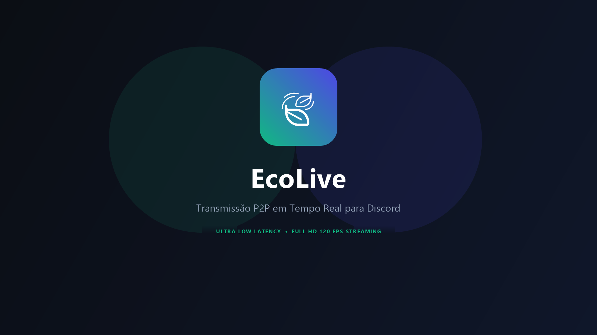

# EcoLive - Low-Latency Distributed Streaming Platform

<p align="center">
  
</p>

<p align="center">
  
  
  
  
  
  
  
</p>

> **Plataforma de transmissão WebRTC de ultra-baixa latência integrada ao ecossistema Discord com autenticação oficial OAuth2. Suporta streaming em tempo real pelo navegador e ingestão profissional via OBS Studio (WHIP Passthrough) com até 120 FPS.**  
> *Autor: Kayque Reis ([@kr3mega](https://github.com/kr3mega))*

---

## 1. Visão Geral

O **EcoLive** é uma infraestrutura de streaming em tempo real projetada para entregar transmissão de alta fidelidade (**1080p a 60 / 120 FPS**) com latência inferior a **200ms**, eliminando o atraso de 5 a 15 segundos comum em plataformas tradicionais.

---

## 2. Arquitetura e Diferenciais

* **Latência Ultra-Baixa Real (< 200ms):** Transporte de pacotes de mídia via UDP/SRTP diretamente aos nós de distribuição, sem segmentação HLS/DASH.
* **Autenticação e Identidade Discord:** Integração com Discord OAuth2 para identificação de participantes, renderização de avatares oficiais e validação de permissões de guilda.
* **Transmissão Sob Demanda:** Entrada seletiva nas transmissões. Espectadores que não estão assistindo consomem 0 kbps de tráfego de rede no servidor, poupando assim o consumo de rede do próprio usuário e da infraestrutura.
* **Transmissão Profissional via OBS Studio (WHIP):** Suporte nativo ao protocolo WHIP (*WebRTC HTTP Ingestion*). O fluxo de transmissão é codificado diretamente por hardware (NVENC/AMF/AV1) e entregue ao servidor sem impacto no processador.
* **Grid Multistream Dinâmico:** Visualização simultânea de múltiplos participantes em formato de mosaico.

---

## 3. Stack Tecnológica

| Camada | Tecnologias Utilizadas |
| :--- | :--- |
| **Frontend** | Next.js 16 (App Router, Turbopack), React 19, TypeScript, Tailwind CSS |
| **Streaming & WebRTC** | LiveKit Client SDK, LiveKit Components, LiveKit Server SDK |
| **Identidade** | Discord OAuth2 API, CDN Avatars, HMAC-SHA256 Session Vault |
| **Distribuição de Streaming** | LiveKit SFU (Go), LiveKit Ingress (WHIP Server), Redis Cluster |
| **Borda e Proxy** | Caddy Server (TLS automático, HTTP/3), UFW Firewall |
| **Infraestrutura** | Containers Docker isolados, Linux Enterprise Server |

---

## 4. Como Executar Localmente

### Pré-requisitos
* **Node.js:** Versão 20+ e gerenciador de pacotes npm
* **Docker & Docker Compose:** Para orquestração dos serviços de tempo real (LiveKit SFU, Ingress e Redis)
* **Discord Developer Portal:** Aplicação cadastrada para handshake OAuth2

### Passo 1: Inicializar a Infraestrutura (LiveKit + Redis + Ingress)
Na raiz do repositório, configure e execute os containers da infraestrutura:
```bash
cd infra
cp .env.example .env
docker compose up -d
```
> O LiveKit SFU iniciará nas portas `7880` (HTTP/WebSocket) e `7881` (WebRTC signaling), com o servidor Ingress WHIP ativo na porta `8085`.

### Passo 2: Executar a Aplicação Frontend
Em outro terminal, instale as dependências e inicie o servidor Next.js em modo de desenvolvimento:
```bash
cd frontend
cp .env.example .env.local
npm install
npm run dev
```
Acesse `http://localhost:3000` para interagir com a interface ou conectar via proxy do Discord.

---

## 5. Licença

Este repositório é disponibilizado sob o modelo **Source-Available** exclusivamente para fins de avaliação técnica, estudo e auditoria de portfólio. Todos os direitos reservados a [Kayque Reis](https://github.com/kr3mega).

O software é fornecido no estado em que se encontra (*AS IS*), sem garantias explícitas ou implícitas de qualquer natureza. É expressamente proibida a exploração comercial, redistribuição ou hospedagem deste código como serviço sem autorização prévia por escrito.

---

<p align="center">
  Desenvolvido por <a href="https://github.com/kr3mega">Kayque Reis</a>.
</p>
